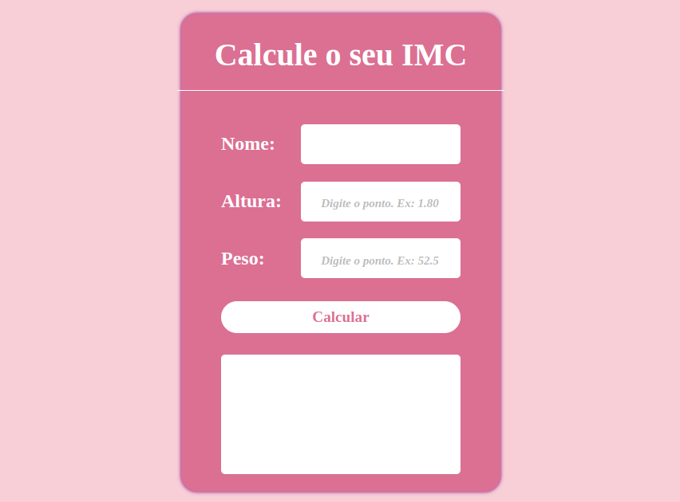

# 📊 Calculadora de IMC  

Uma aplicação simples para calcular o **Índice de Massa Corporal (IMC)**, desenvolvida com **HTML, CSS e JavaScript**.
O meu objetivo ao desenvolver este mini projeto foi treinar e aumentar o meu conhecimento em programação WEB.

## 🚀 Teste agora! 
🔗 Acesse o projeto online: [Calculadora de IMC](https://vanssarts.github.io/calculadora-imc/)  

 
